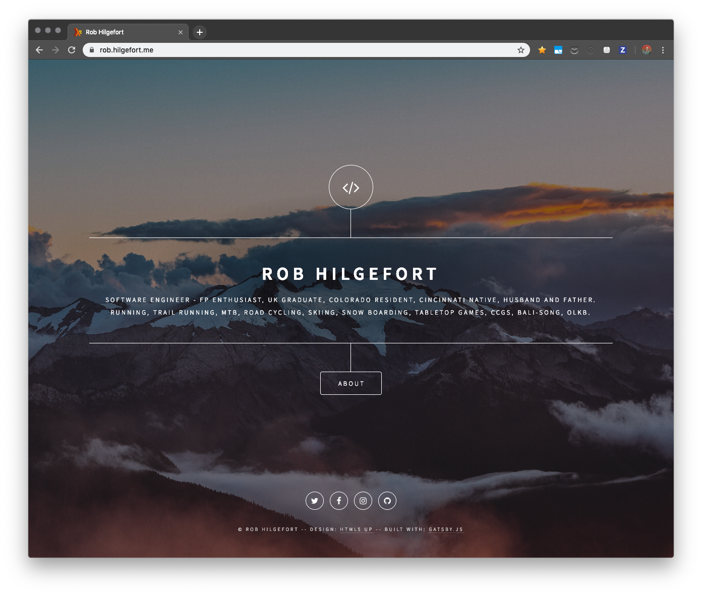

# Rob.Hilgefort.me

Personal page for [@rjhilgefort](https://twitter.com/rjhilgefort)

### Live At

- [https://rob.hilgefort.me](https://rob.hilgefort.me)
- [https://robhilgefort.com](https://robhilgefort.com)

## Built With

- Framework: [Gatsbyjs](https://www.gatsbyjs.org/)
- Theme: [gatsby-starter-dimension](https://github.com/codebushi/gatsby-starter-dimension)

## TODO / ZenHub

I use ZenHub to manage tasks for this project and that can be found [here](https://github.com/rjhilgefort/rjh-personal-page/pulls#workspaces/rjh-personal-page-5c5e824c50948f1f85b8d60a/boards?repos=159270706)